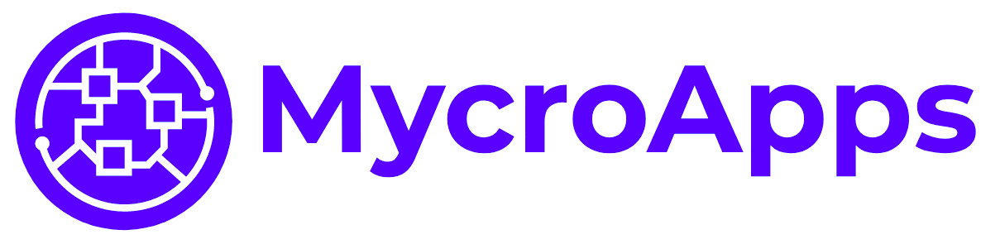

## MycroApps



Demo: [mycroapps.netlify.app](https://mycroapps.netlify.app/)

---

### MicroApps - Why?

The rationale behind MicroApps is:

- Cordova / Deployment: Only need to submit the “Parent App” to App Stores (the MicroApp’s are loaded dynamically)
- Testing: QA can test the updated MicroApp in the knowledge the Parent App has not been modified
- Performance: Assets loaded dynamically as needed
- Smaller bundles: multiple MicroApp bundles as opposed to single Monolith bundle
- Independent deployment: Reduce the scope of any given deployment and in turn reduce the associated risk
- Autonomous teams: Separate developers working on separate MicroApps (....MicroApps could even be written in different languages!)
- Encourage good practice / separation of concerns: e.g. Schedule specific assets in Schedule MicroApp only. Shared assets treated as such

---

### MicroApps - How? (_contrived run time example_)

- iFrames: Isolated Apps (comms with postMessage)
- Build time: Private NPM packages (or hosted registries)
- Run time: Parent App consumes MicroApp via Javascript files

MycroApps uses a runtime approach (see contrived example [here](./runtime-demo))

---

### Getting Started

**Development**

- `npm install`
- `npm start`

**Production**

- `npm run build`
- serve the `dist` folder for app / microapps
- serve the `dashboard` folder to demo microapps individually

---

### Commands

The following commands can be executed in the root folder (e.g. npm run start:app)

- `start`: Runs the main "parent" App
- `start:account`: Runs the Account MicroApp
- `build:dist`: Builds the folder that gets deployed
- `build:dashboard`: Builds the MicroApp Dashboard (for QA / internal)
- `build`: Installs and build all libs, components, microapps and parent app

---

### To create new microapp

_NB this process should - and will one day - be automated with a script_

- copy existing microapp folder (e.g. `account`)

**In parent App**

- `src/app.js`: create new route with `<MicroApp/>` component
- `package.json`: add new object to `apps` array and add start script. e.g.

```JSON
{
  "id": "messages",
  "name": "Messages",
  "url": "messages/#/messages"
}
```

**Create new MicroApp called Messages**

- `webpack.config.js`: rename `id` to "messages"
- `package.json`: rename `name` in name field - and in `prebuild` and `postbuild` scripts - to "messages" (and remove any unneeded dependencies)
- `app.js`: rename route to "messages" and remove unwated content
- `index.js`: rename render and mount functions (`renderMessages` and `unmountMessages`)
- `index.ejs`:
  - rename title to "messages"
  - change `onload` script (i.e. `window.onload = () => {window.renderMessages('container')`)
  - change `src` of script tag (i.e. `microapp-messages.min.js`)
